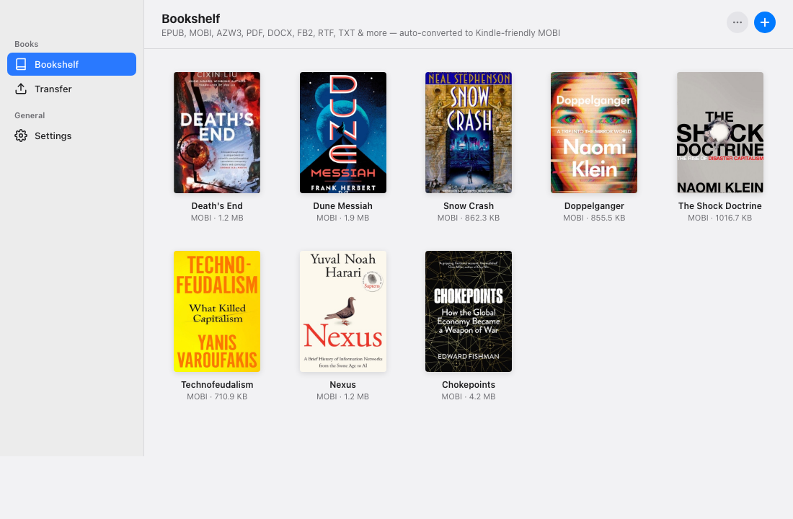

# Airshelf

Wirelessly send ebooks from your Mac to your Kindle over your local Wi-Fi network. No Amazon account, no cables, no email-to-Kindle, no cloud.



## How it works

1. Drag and drop ebooks into the Airshelf Mac app (EPUB, PDF, DOCX, FB2, RTF, AZW3 and more).
2. Airshelf auto-converts them to Kindle-friendly MOBI (via Calibre's `ebook-convert`) and rescues missing cover art and metadata from [Open Library](https://openlibrary.org).
3. Open the **Transfer** tab, copy the `http://<your-mac-ip>:6790` URL, and type it into the Kindle's experimental web browser.
4. Tap **Download** next to any book — your Kindle grabs it directly from your Mac.

All transfers stay on your LAN. Nothing ever touches the internet except the Open Library metadata lookup.

## Features

- **Drag-and-drop import** — drop ebooks on the window or use the `+` button
- **Wide format support** — EPUB, MOBI, AZW3, PDF, DOCX, FB2, LIT, LRF, PDB, RTF, ODT, HTML, CHM, CBZ, CBR, TXT, PRC, AZW
- **Auto-conversion to MOBI** — non-native formats are converted at import time using Calibre's `ebook-convert` with the `kindle_pw3` profile, which also rescales embedded images so books stay small (typical 18MB EPUB → 5MB MOBI)
- **Cover rescue** — if the source file has no embedded cover, Airshelf queries Open Library by title/author and pulls the cover down automatically. Covers are resized to a Kindle-friendly 500px thumbnail so the e-ink browser doesn't render them line-by-line.
- **Metadata normalisation** — titles lifted from filenames get cleaned of author suffixes and series markers (`Death's End (The Three-Body Problem) -- Cixin Liu` → `Death's End`), and author/year are pulled from Open Library when missing
- **Kindle-optimised download page** — black-on-white table-based layout, uniform covers, numbered list, large right-aligned download button, aggressive image caching with ETag + long `max-age`
- **Right-click menu** on any book — Show in Finder, Copy download URL, Re-fetch cover, Remove from library
- **Click-to-select + Delete/Backspace** to remove
- **No sign-in, no cloud, no tracking**

## Running locally

### Prerequisites

- **macOS** (the built-in `sips` image resizer and Calibre binaries are used)
- **Node.js 18+** — [nodejs.org](https://nodejs.org/) or `brew install node`
- **Calibre** — for EPUB/PDF/DOCX → MOBI conversion:
  ```sh
  brew install --cask calibre
  ```

### Install and run

```sh
git clone https://github.com/caldvs/airshelf.git
cd airshelf
npm install
npm start
```

The Electron app opens, and the HTTP server starts listening on `http://0.0.0.0:6790`.

### Sending to a Kindle

1. Make sure your Kindle and your Mac are on the same Wi-Fi network.
2. On the Kindle: Home → `⋮` top-right → **Web Browser**.
3. Type the URL shown in the **Transfer** tab (`http://192.168.x.x:6790`).
4. Tap **Download** next to any book.

The Kindle's experimental browser only accepts a specific set of file extensions (`.mobi`, `.prc`, `.azw`, `.txt`), which is why Airshelf converts everything to MOBI on import. Once downloaded, the book shows up in your Kindle library alongside your Amazon purchases.

## Project layout

```
airshelf/
├── main.js              Electron main process, HTTP server, conversion, metadata enrichment
├── preload.js           contextBridge exposing IPC to the renderer
├── renderer/
│   ├── index.html       Electron bookshelf UI
│   ├── style.css
│   └── renderer.js
├── build/
│   ├── icon.svg         App icon source
│   └── icon.icns        macOS icon bundle
├── package.json
└── screenshot.png       README screenshot
```

Books are stored in Electron's `userData` directory (`~/Library/Application Support/Airshelf/books/`) with a `books.json` manifest describing each entry.

## How the Kindle-facing page is kept fast

The Kindle's experimental browser is an old WebKit with slow e-ink rendering. Airshelf's download page is tuned for it:

- Table-based layout (no flexbox or grid)
- Pure black text, no greys
- Covers pre-resized to max 500px via `sips`, served with `Cache-Control: public, max-age=2592000, immutable` and an ETag so they're cached for 30 days
- Index page sent with `Cache-Control: no-store` so the book list always refreshes

## Tech choices

- **Electron** — desktop window + HTTP server in a single Node process
- **adm-zip** — pure JS EPUB (zip) parsing for cover/title extraction
- **Calibre `ebook-convert`** — rock-solid conversion across 15+ ebook formats
- **macOS `sips`** — zero-dep image resizing for cover thumbnails
- **Open Library** — free API for author/year/cover lookups, no key required
- No build step, no bundler, no framework. Just plain HTML + CSS + JS in the renderer.

## License

MIT
